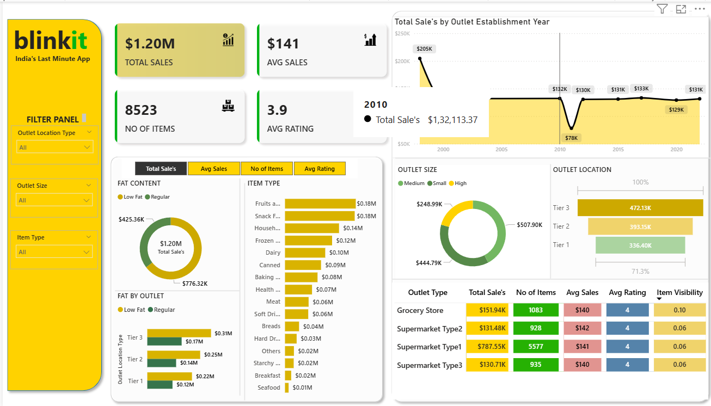

# 🛒 Blinkit Real-Time Grocery Analytics - Executive Dashboard



[](https://powerbi.microsoft.com/)
[](https://www.python.org/)
[](https://streamlit.io/)
[](https://plotly.com/)
[](#license)

---

## 📌 Project Overview

This repository contains the complete **Blinkit Real-Time Grocery Analytics Executive Dashboard**. The project features an interactive **Power BI Dashboard** (`dashboard.png`) and **Streamlit Web Application** (`app.py`) designed to give business leaders real-time visibility into overall sales performance, customer preferences, item categorizations, and outlet level efficiencies across various city tiers.

---

## 📁 Project Resources & Documentation

All project documentation, datasets, and presentation decks included in this repository:

| Resource Type | File Name | Description | Link |
|---|---|---|---|
| 🖼️ **Power BI Dashboard** | `dashboard.png` | Executive Power BI dashboard screenshot | [View Dashboard](dashboard.png) |
| 📄 **DAX / SQL Queries** | `Query Doc (1).docx` | Contains all DAX measures, calculated columns & SQL scripts | [Download Document](Query%20Doc%20(1).docx) |
| 📊 **Executive Deck** | `Blinkit Analysis.pptx` | Comprehensive executive presentation & slide deck | [Download Presentation](Blinkit%20Analysis.pptx) |
| 📁 **Raw Dataset (CSV)** | `BlinkIT Grocery Data.csv` | Full raw grocery transaction dataset in CSV format | [View CSV Dataset](BlinkIT%20Grocery%20Data.csv) |
| 📊 **Excel Dataset** | `BlinkIT Grocery Data.xlsx` | Formatted Excel workbook dataset with tables | [View Excel Dataset](BlinkIT%20Grocery%20Data.xlsx) |
| ⚙️ **JSON Data Feed** | `blinkit.json` | Unstructured JSON dataset & dashboard export configuration | [View JSON Data](blinkit.json) |

---

## 📊 Key Business Metrics (KPI Highlights)

| Metric | Value | Business Impact |
|---|---|---|
| 💰 **Total Sales** | **$1.20 Million** | Total revenue generated across all grocery outlets |
| 📦 **Total Items Sold** | **8,523** | Total unit volume of grocery inventory ordered |
| 🏷️ **Average Sales** | **$141** | Average order transaction ticket size |
| ⭐ **Average Rating** | **3.9 / 5.0** | Overall customer satisfaction rating |

---

## 🚀 Key Dashboard Visuals & Analysis

- 🟡 **Filter Panel**: Slice dynamic data by **Outlet Location Type** (Tier 1, Tier 2, Tier 3), **Outlet Size** (High, Medium, Small), and **Item Type**.
- 📈 **Outlet Establishment Trend**: Sales growth analysis over establishment years (2011 to 2022).
- 📦 **Fat Content Breakdown**: **Low Fat** ($776.32K) vs **Regular** ($425.36K) revenue performance.
- 🏪 **Outlet Location Tier Breakdown**: Tier 3 ($472.13K), Tier 2 ($393.15K), and Tier 1 ($336.40K).
- 📋 **Outlet Type Matrix**: Summary breakdown across Grocery Stores, Supermarket Type 1, Supermarket Type 2, and Supermarket Type 3.

---

## 🛠️ Repository Structure

```bash
Real-Time-Power-BI-Project-main/
│
├── dashboard.png                  # Main Power BI Dashboard Image
├── Query Doc (1).docx             # DAX & SQL Documentation
├── Blinkit Analysis.pptx          # Executive Presentation Deck
├── BlinkIT Grocery Data.csv      # Main CSV Dataset
├── BlinkIT Grocery Data.xlsx     # Main Excel Dataset
├── blinkit.json                   # JSON Data Feed
│
├── app.py                         # Streamlit Interactive Analytics Application
├── Sales.png                      # Total Sales KPI Card Asset
├── Avg Sales.png                  # Avg Sales KPI Card Asset
├── Items.png                      # Total Items KPI Card Asset
├── rating (1).png                 # Rating KPI Card Asset
└── README.md                      # Repository Documentation
```

---

## 💻 Running the Interactive App Locally

```bash
# 1. Clone Repository
git clone https://github.com/Sagar-DataAnalyst/Blinkit-Real-Time-Grocery-Analytics-Executive-Power-BI-Dashboard.git

# 2. Install dependencies
pip install streamlit pandas plotly openpyxl

# 3. Run Streamlit Application
streamlit run app.py
```

---

## 👤 Author

Developed by **Sagar Maharana**  
- GitHub: [@Sagar-DataAnalyst](https://github.com/Sagar-DataAnalyst)  
- Email: `maharanasagar14312@gmail.com`
